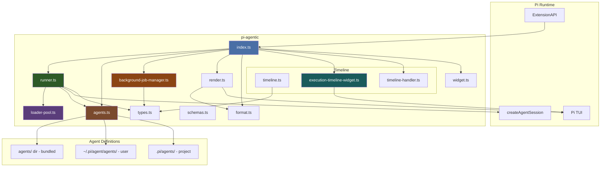
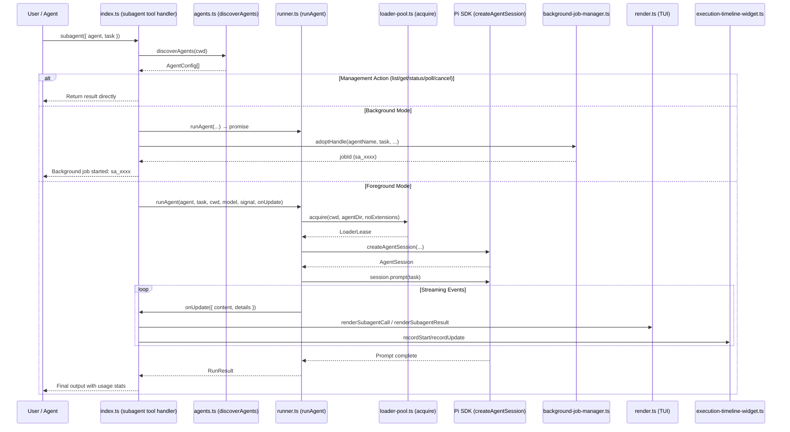
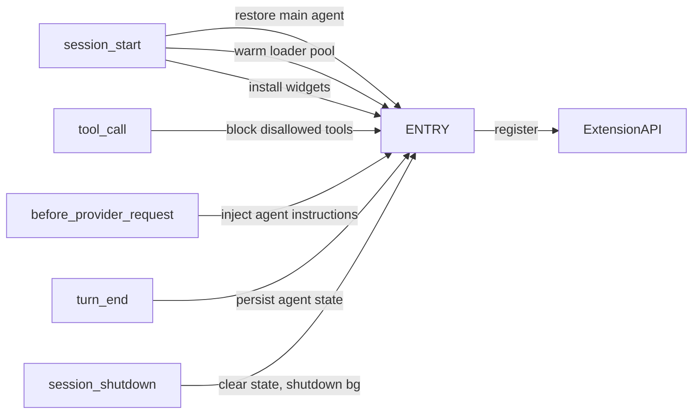
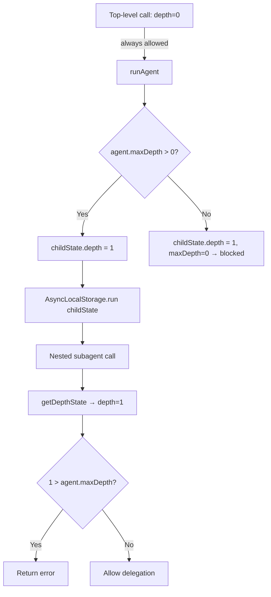

# pi-agentic — Architecture Document

> **Version:** 0.9.4 · **License:** MIT  
> **Purpose:** A "team-lead" extension for the [Pi coding agent](https://github.com/earendil-works/pi-coding-agent) that enables in-process subagent delegation — dispatching tasks to specialized subagents (scout, planner, worker, etc.) running in the same process via `createAgentSession()`.

---

## Table of Contents

1. [Overview](#overview)
2. [Architecture Diagram](#architecture-diagram)
3. [File Map](#file-map)
4. [Core Data Flow](#core-data-flow)
5. [Module Deep Dives](#module-deep-dives)
   - [index.ts — Extension Entry Point](#indexts--extension-entry-point)
   - [runner.ts — Agent Runner & Depth Gating](#runnerts--agent-runner--depth-gating)
   - [agents.ts — Agent Discovery](#agentsts--agent-discovery)
   - [loader-pool.ts — Resource Loader Pooling](#loader-poolts--resource-loader-pooling)
   - [background-job-manager.ts — Background Job Lifecycle](#background-job-managerts--background-job-lifecycle)
   - [Timeline System](#timeline-system)
   - [render.ts — TUI Rendering](#renderts--tui-rendering)
   - [format.ts — Formatting Helpers](#formats--formatting-helpers)
   - [schemas.ts — Parameter Validation](#schemasts--parameter-validation)
   - [types.ts — Shared Types](#typests--shared-types)
   - [widget.ts — Legacy Widget (Stubs)](#widgetts--legacy-widget-stubs)
6. [Bundled Agent Roster](#bundled-agent-roster)
7. [Delegation Modes](#delegation-modes)
   - [Single Mode](#single-mode)
   - [Parallel Mode](#parallel-mode)
   - [Background Mode](#background-mode)
8. [Main Agent System](#main-agent-system)
9. [Commands & Shortcuts](#commands--shortcuts)
10. [Dependency Graph](#dependency-graph)
11. [Design Patterns & Key Decisions](#design-patterns--key-decisions)

---

## Overview

**pi-agentic** is an extension for the Pi coding agent that plugs into the Pi runtime lifecycle (session start, tool calls, provider requests, turn end, session shutdown). It provides:

- **Subagent delegation** — run specialized agents in-process with zero cold-start overhead
- **Three delegation modes** — single (one agent, one task), parallel (concurrent fan-out), background (fire-and-forget)
- **Depth gating** — prevents runaway nested delegation via `AsyncLocalStorage`-scoped depth tracking
- **Agent discovery** — loads agent `.md` definitions from three sources (bundled, user, project) with priority layering
- **Main agent system** — persists an agent personality ("main agent") that filters tools and injects system prompts
- **Execution timeline** — a persistent Gantt-chart TUI widget showing subagent execution history
- **Background job management** — concurrent background subagents with auto-eviction, polling, and cancellation
- **Foreground→background detach** — migrate a running foreground subagent to background at any time (Ctrl+Shift+B)

---

## Architecture Diagram



---

## File Map

| File | Lines | Responsibility |
|---|---|---|
| `index.ts` | ~650 | Extension entry point. Registers with Pi runtime, hooks into lifecycle events, registers `subagent` tool, commands, and keyboard shortcut. Manages main-agent persistence, foreground detach, and tool filtering. |
| `runner.ts` | ~260 | In-process agent runner. Creates transient `AgentSession`, enforces depth-gating via `AsyncLocalStorage`, streams events via `onUpdate`. Exports `runAgent()`, `mapConcurrent()`, `checkDepthGate()`, `getDepthState()`. |
| `agents.ts` | ~150 | Agent discovery from 3 sources (bundled, user, project). Parses frontmatter with `name`, `description`, `tools`, `model`, `maxDepth`. Exports `discoverAgents()`, `agentNeedsExtensions()`, `AgentConfig`, `AgentTools`. |
| `loader-pool.ts` | ~160 | Pooled `ResourceLoader` cache. One-loader-per-`(cwd, agentDir, noExtensions)` tuple. FIFO idle queue. `AgentPromptResourceLoader` wrapper for system prompt override. |
| `background-job-manager.ts` | ~180 | Manages background subagent lifecycle. Configurable `maxRunning` (10), `maxTotal` (50), eviction timeout (5 min). Auto-evicts oldest completed jobs. |
| `background-types.ts` | ~30 | Background job type definitions: `BackgroundJobStatus`, `BackgroundSubagentJob`, `BackgroundJobManagerOptions`, `BackgroundJobResult`, `BackgroundHandleLike`. |
| `execution-timeline-widget.ts` | ~430 | Persistent Gantt timeline TUI widget (key: `execution-timeline`, placement: `belowEditor`). Manages timeline state, settings persistence, rolling window, 26-color agent palette, heartbeat-based live re-rendering. |
| `timeline.ts` | ~250 | Static Gantt-style timeline renderer for completed parallel batches. Supports real-time + turn-count modes, rolling window filter, peak parallelism calculation. 26-color agent palette. |
| `timeline-handler.ts` | ~240 | `/timeline` command handler with autocomplete. Subcommands: `clear`, `max`, `bar`, `window`, `time`, `status`, `help`. Duration parser (s/m/h). |
| `render.ts` | ~310 | TUI `Component` factories for tool call and result rendering. `renderSubagentCall()` shows live prompt streaming. `renderSubagentResult()` provides tree-based display for single + parallel modes. |
| `format.ts` | ~140 | Pure formatting helpers: `formatTools()`, `summarizeToolArgs()`, `formatDuration()`, `summarizeTask()`, `formatTokens()`, `formatUsage()`, `getFinalText()`, `formatBgJobSummary()`, `formatBgJobDetails()`. |
| `schemas.ts` | ~60 | Typebox parameter schema for the `subagent` tool (single, parallel, background, management actions, scope filter). |
| `types.ts` | ~60 | Shared TypeScript types: `ToolCallEntry`, `ExecutionEvent`, `RunResult`, `AgentRowStatus`, `SubagentDetails`, `OnUpdate`, `TimelineEntry`. |
| `widget.ts` | ~120 | Legacy live-status subagent bar widget. **All methods are no-op stubs** — the widget API was migrated to `execution-timeline-widget.ts`. Retained for API compatibility. |
| `agents/` (dir) | 13 `.md` files | Bundled agent definitions with frontmatter specifying name, description, tools, and maxDepth. |

---

## Core Data Flow

### Subagent Tool Call Flow



### Lifecycle Hook Points



---

## Module Deep Dives

### index.ts — Extension Entry Point

**Role:** The orchestrator of the entire extension. It's the single file that interfaces with the Pi runtime's `ExtensionAPI`.

#### What it registers:

| Resource | Details |
|---|---|
| **`subagent` tool** | The primary tool. Accepts `SubagentParams` (Typebox schema). Supports single, parallel, background, and management actions. |
| **`/agent` command** | Switch the main agent personality. Supports `reload` subcommand to re-scan the `~/.pi/agent/agents/` directory. |
| **`/subagent:bg` command** | List active foreground jobs or detach one by ID to background. |
| **`/subagent:bg-status` command** | Show background job status with interactive selector. |
| **`/subagent:bg-cancel` command** | Cancel a running background job with confirmation. |
| **`/timeline` command** | Configure the execution timeline widget (max, window, bar, time, clear, status, help). Also registered as `/tl`. |
| **`Ctrl+Shift+B` shortcut** | Detach the current foreground subagent to background. |

#### Lifecycle hooks:

| Hook | Action |
|---|---|
| `session_start` | Restore persisted main agent, load agent catalog, warm loader pool, install both widgets (`subagent-bar` + `execution-timeline`). |
| `tool_call` | Block tools not in the active main agent's allowlist. |
| `before_provider_request` | Inject main agent's system prompt instructions into the provider payload. |
| `turn_end` | Persist the current main agent selection to `~/.pi/agent/main-agent-state.json`. |
| `session_shutdown` | Clear agent widget, shut down `BackgroundJobManager`, clear loader pool. |

#### Module-level state:

| Variable | Type | Purpose |
|---|---|---|
| `_bgManager` | `BackgroundJobManager \| null` | Singleton background job manager |
| `_onBgJobComplete` | `((job) => void) \| null` | Callback when background job finishes |
| `_setBgStatus` | `((text) => void) \| null` | Updates TUI status bar with background count |
| `_fgJobs` | `Map<string, ForegroundDetachEntry>` | Registry of running foreground jobs that can be detached |
| `_currentAgent` | `string \| undefined` | Currently selected main agent name |
| `_agentCatalog` | `Map<string, AgentDef>` | Parsed agent definitions from `~/.pi/agent/agents/` |
| `_baselineTools` | `string[]` | All tools available at session start |
| `_agentCtx` | `ExtensionContext` | Cached extension context |

---

### runner.ts — Agent Runner & Depth Gating

**Role:** Creates transient `AgentSession` instances per subagent call, enforces depth limits, and streams execution events back to the caller.

#### Key exports:

| Export | Type | Purpose |
|---|---|---|
| `runAgent()` | `(agent, task, cwd, modelOverride, signal, onUpdate, deps?) => Promise<RunResult>` | Core function: loads extensions, creates session, subscribes to events, prompts the model. |
| `mapConcurrent()` | `<TIn, TOut>(items, concurrency, fn) => Promise<TOut[]>` | Bounded concurrency executor (worker-pool pattern). |
| `checkDepthGate()` | `(depth, maxDepth) => { allowed: boolean; reason?: string }` | Pure function deciding if a nested call should proceed. |
| `getDepthState()` | `() => DepthState` | Read depth in the current `AsyncLocalStorage` context. |
| `getAuth()` | `() => { authStorage, modelRegistry }` | Lazily-created auth + model registry singletons. |

#### Depth gating mechanism:



- Uses `AsyncLocalStorage` so overlapping parallel agents don't interfere with each other's depth state.
- Top-level calls (`depth === 0`) are always allowed.
- Each agent's `maxDepth` frontmatter field controls how many levels of nested delegation it may spawn.
- `orchestrator` has `maxDepth: 2`; most specialist agents have `maxDepth: 0` (cannot delegate further) or `maxDepth: 1` (can delegate to leaf agents).

#### Event streaming:

Inside `runAgent()`, a `session.subscribe()` listener transforms Pi SDK events into a unified `OnUpdate` callback:

| Pi SDK Event | Transformation |
|---|---|
| `tool_execution_start` | Push `ToolCallEntry` with `id`, `name`, `argSummary` + emit `ExecutionEvent.tool_start` |
| `tool_execution_end` | Attach `result`, `isError`, `durMs` to matching `ToolCallEntry` + emit `ExecutionEvent.tool_end` |
| `message_update` / `text_delta` | Accumulate `currentDelta`, emit updates |
| `message_end` | Finalize turn usage stats, update `lastOutput`, reset `currentDelta` |

A 1-second heartbeat `setInterval` re-emits the latest state even without new events, keeping the TUI responsive.

---

### agents.ts — Agent Discovery

**Role:** Scans three sources for `.md` agent definition files and resolves them into `AgentConfig` objects.

#### Discovery priority (highest wins):

```
Bundled agents/ dir  (inside the package)
    ↓ overridden by
~/.pi/agent/agents/  (user-level, global)
    ↓ overridden by
.pid/agents/         (project-level, walks up from cwd)
    ↓ fallback
.agents/             (legacy project-level)
```

#### Agent frontmatter schema:

```yaml
---
name: agent-name         # Required — unique identifier
description: ...         # Required — short description
tools: all               # Optional — "all" | "builtins" | "none" | "read,write,bash,..."
model: provider/model   # Optional — model override
maxDepth: 1             # Optional — default 0 (no nested delegation)
---
System prompt body here...
```

#### `AgentTools` type semantics:

| Value | Effect |
|---|---|
| unset / `"all"` | All builtins + all parent extensions (web_search, fetch_content, MCP, etc.) |
| `"builtins"` | Built-in coding tools only: `read`, `bash`, `edit`, `write`, `grep`, `find`, `ls` |
| `"none"` | No tools at all |
| `"tool1,tool2,..."` | Explicit allowlist; extensions auto-loaded if any listed tool is non-builtin |

#### `agentNeedsExtensions(tools)`:

Returns `true` if the agent needs full extension loading (MCP, web search, etc.), `false` for builtins-only or none. This is used by the loader pool to decide whether to create an extension-capable or lean loader.

---

### loader-pool.ts — Resource Loader Pooling

**Role:** Caches `ResourceLoader` instances keyed by `(cwd, agentDir, noExtensions)` to avoid repeated, expensive extension/resource graph loading.

#### Architecture:

```mermaid
flowchart LR
    subgraph Pool
        E1[Entry: (cwd, dir, ext)]
        E2[Entry: (cwd, dir, noext)]
    end
    E1 --> Idle1[FIFO idle[]]
    E1 --> Active1[active Set]
    E1 --> Warming1[warming Set]
    Acquire[acquire()] -->|pop idle| Idle1
    Acquire -->|await warming| Warming1
    Acquire -->|create new| E1
```

#### Key design:

- **`LoaderPool.acquire()`** — Returns the first idle loader (if warm), awaits a concurrent warming operation, or creates a fresh loader via the factory. Returns a `LoaderLease` with a `release()` callback that returns the loader to the idle pool.
- **`AgentPromptResourceLoader`** — A proxy that wraps the base `ResourceLoader` and overrides `getSystemPrompt()` with the agent-specific system prompt. This avoids re-creating the loader for each agent.
- **`allowUiPaint()`** — Yields the event loop (via `setImmediate` + `setTimeout`) before CPU-heavy extension loading, giving the TUI a chance to paint the initial "running" state so pi doesn't appear frozen.
- **`warm()`** — Pre-warms a loader asynchronously. Called on `session_start` (after a 1s delay) so the first `tools: all` subagent call reuses loaded extensions instead of blocking.

---

### background-job-manager.ts — Background Job Lifecycle

**Role:** Manages the lifecycle of fire-and-forget background subagent jobs.

#### State machine:

```mermaid
flowchart LR
    S[running] -->|success| C[completed]
    S -->|error| F[failed]
    S -->|cancel()| X[cancelled]
    C -->|eviction timeout| EVICT[evicted]
    F -->|eviction timeout| EVICT
    X -->|eviction timeout| EVICT
```

#### Configuration:

| Option | Default | Description |
|---|---|---|
| `maxRunning` | 10 | Maximum concurrent background agents |
| `maxTotal` | 50 | Maximum total job history entries |
| `evictionMs` | 300,000 (5 min) | Time after completion before job is evicted |

#### Key features:

- **`adoptHandle()`** — Takes a `BackgroundHandleLike` (with `abort()` and optional `detach()`) and wraps it into a managed `BackgroundSubagentJob`. Used for both fresh background starts and foreground→background detach.
- **`cancel()`** — Aborts the underlying `AbortController`, marks the job as `cancelled`.
- **Auto-eviction** — Completed/failed/cancelled jobs are evicted after `evictionMs`. If the total exceeds `maxTotal`, the oldest completed job is evicted immediately.
- **`onJobComplete` callback** — Delivered via `queueMicrotask`; triggers the user notification in `index.ts` that announces completion.

---

### Timeline System

The extension has **two timeline implementations** that share the same color palette and visual style:

#### 1. `timeline.ts` — Static Rendering (for result panels)

- Renders a Gantt chart after a parallel batch completes.
- Appended to the tool result output, not persistent.
- Supports `real` time (HH:MM:SS) and `turn` count modes.
- Calculates peak parallelism by sampling 100 points across the total span.
- 26-color agent palette (round-robin assignment via `_assignedColors` map).

#### 2. `execution-timeline-widget.ts` — Persistent TUI Widget

- Registered with key `"execution-timeline"` at placement `belowEditor`.
- Shows a live Gantt chart of recent subagent executions, accumulated across sessions.
- **Heartbeat re-renders** every 500ms while any agent is running.
- **Settings persistence** — `maxVisible`, `rollingWindowMs`, `timeMode`, `barWidthRatio` saved to `settings.json` under the `timeline` key.
- **Rolling window** — filters entries to only those within the last N milliseconds (default: 5 min). Configurable via `/timeline window <duration>`.
- **Time modes** — `real` (absolute HH:MM:SS) or `turn` (cumulative turn counts).
- **Visual elements:**
  - Header with entry count and running indicator
  - Time axis with tick marks
  - Per-agent horizontal bars (`█` active, `░` idle) colored by agent identity
  - Duration, tool count, token usage, and cost annotations
  - Footer with summary stats (peak parallelism or total turns, average duration)
- **Public API:** `recordStart()`, `recordUpdate()`, `recordEnd()`, `recordParallelStart()`, `recordParallelUpdate()`, `finalizeAllRunning()`, `clearTimelineHistory()`, `setMaxVisible()`, `setRollingWindow()`, `setTimeMode()`, `toggleTimeMode()`, `loadTimelineSettings()`, `saveTimelineSettings(), `reinstallTimelineWidget()`.

#### 3. `timeline-handler.ts` — Command Interface

- Handles `/timeline` and `/tl` commands.
- Provides autocomplete for subcommands and their arguments.
- Subcommands:

| Subcommand | Example | Effect |
|---|---|---|
| `clear` | `/timeline clear` | Reset all timeline history |
| `max <N>` | `/timeline max 10` | Set max visible entries (1–50, default 6) |
| `bar <PCT>` | `/timeline bar 75` | Set bar width percentage (10–100, default 75) |
| `window <dur>` | `/timeline window 5m` | Set rolling time window (s/m/h, or `off`) |
| `time [real\|turn]` | `/timeline time turn` | Switch time mode |
| `status` | `/timeline status` | Show current settings |
| `help` | `/timeline help` | Show detailed usage guide |

#### Color palette (shared by both):

```typescript
const AGENT_COLORS = [
  "\x1b[38;5;75m",   // soft blue
  "\x1b[38;5;114m",  // soft green
  "\x1b[38;5;222m",  // soft yellow
  "\x1b[38;5;183m",  // soft purple
  // ... 22 more 256-color ANSI codes
];
```

Colors are assigned round-robin per agent name and cached for the session.

---

### render.ts — TUI Rendering

**Role:** Produces TUI `Component` objects (from `@earendil-works/pi-tui`) that render the `subagent` tool's call arguments and execution results.

#### `renderSubagentCall(args, theme, context)`:

| Context State | Display |
|---|---|
| Waiting for prompt | `Subagent orchestrator · waiting for prompt` |
| Prompt being written | `Subagent orchestrator · writing prompt` |
| Prompt complete, not started | `Subagent orchestrator · starting` |
| Execution started | `Subagent orchestrator · running` (compact) |

- Reads `settings.json` → `fastSubagent.promptPreviewLines` for preview line count (default: 12).
- For parallel calls, shows a numbered list of `[agent] task` lines.
- Results are cached by `(args, executionStarted, argsComplete, width)` to avoid re-render churn.

#### `renderSubagentResult(result, opts, theme)`:

**Parallel mode:** Displays a process tree:

```
Parallel Task ── 3/5 done ── 12.4s
├── scout ✓ 2.3s (3 tools)
│     read, grep, find results...
├── researcher → (1 tool)
│     searching web...
├── worker ✓ 8.1s (12 tools)
│     implementing feature...
├── tester ✓ 1.5s (5 tools)
└── reviewer pending
```

**Single mode:** Displays a compact tree:

```
└── worker ✓ 5.2s (8 tools)
      Implement the auth module...
```

- Reads `settings.json` → `fastSubagent.previewLines` for output preview (default: 12).
- Management actions (list, get, status) show raw text without the tree structure.
- Shows a `Ctrl+Shift+B: move to background` hint while the agent is running.

---

### format.ts — Formatting Helpers

**Role:** Pure functions used across layers for consistent formatting.

| Function | Purpose |
|---|---|
| `formatTools(tools)` | `"all"` / `"builtins (default)"` / `"none"` / `"read, write, bash"` |
| `shortPath(p)` | Relative path from `cwd`, or `"."` if same |
| `summarizeToolArgs(toolName, input)` | Best-effort one-line summary: file path for Read/Write/Edit, command for Bash, pattern for Grep, `agent: task` for subagent |
| `formatDuration(ms)` | `"2m 30s"` or `"5s"` |
| `summarizeTask(task, max)` | Truncate with `...` |
| `formatTokens(n)` | `"500"` / `"1.2k"` / `"15k"` |
| `formatUsage(usage, model?)` | `"5 turns ↑1.2k ↓800 $0.0023 claude-3.5-haiku"` |
| `getFinalText(r)` | Error or output extraction |
| `formatBgJobSummary(job)` | `"sa_abc123 [running] worker · 12s · implement auth"` |
| `formatBgJobDetails(job)` | Full multi-line detail including result/error |

---

### schemas.ts — Parameter Validation

Uses `@sinclair/typebox` for runtime type validation of the `subagent` tool's `parameters` schema.

```typescript
const SubagentParams = Type.Object({
  agent:     Type.Optional(Type.String()),       // Single mode
  task:      Type.Optional(Type.String()),       // Single mode
  model:     Type.Optional(Type.String()),       // Model override
  cwd:       Type.Optional(Type.String()),       // Working directory
  tasks:     Type.Optional(Type.Array(TaskItem)), // Parallel mode
  concurrency: Type.Optional(Type.Number()),     // Parallel concurrency (default 4)
  background: Type.Optional(Type.Boolean()),     // Background flag
  jobId:     Type.Optional(Type.String()),       // Poll/cancel target
  action:    Type.Optional(Type.Union([          // Management actions
    Type.Literal("list"),
    Type.Literal("get"),
    Type.Literal("status"),
    Type.Literal("poll"),
    Type.Literal("cancel"),
    Type.Literal("detach"),
  ])),
  agentScope: Type.Optional(Type.Union([         // Filter for discovery
    Type.Literal("user"),
    Type.Literal("project"),
    Type.Literal("both"),
  ])),
});
```

`TaskItem` supports a `count` field for repeating the same task N times in parallel mode.

---

### types.ts — Shared Types

```typescript
interface ToolCallEntry {
  id: string;
  name: string;
  argSummary: string;
  result?: string;
  isError?: boolean;
  durMs?: number;
}

type ExecutionEvent =
  | { type: "tool_start"; toolCallId: string; toolName: string; argSummary: string; timestamp: number }
  | { type: "text_delta"; text: string; timestamp: number }
  | { type: "tool_end"; toolCallId: string; result: string; isError: boolean; durMs: number; timestamp: number };

interface RunResult {
  output: string;
  exitCode: number;
  error?: string;
  model?: string;
  toolCalls: ToolCallEntry[];
  executionEvents?: ExecutionEvent[];
  usage: { input: number; output: number; cost: number; turns: number };
}

interface AgentRowStatus {
  name: string;
  taskSummary: string;
  status: "pending" | "running" | "done" | "error";
  durMs?: number;
  startOffsetMs?: number;
  batchStartTime?: number;
  usage?: RunResult["usage"];
  toolCalls?: ToolCallEntry[];
  responseText?: string;
}

interface SubagentDetails {
  mode?: "single" | "parallel";
  agentName?: string;
  task?: string;
  parallelAgents?: AgentRowStatus[];
  usage: RunResult["usage"];
  running: boolean;
  elapsedMs?: number;
  model?: string;
  backgroundJobId?: string;
  toolCalls: ToolCallEntry[];
  executionEvents?: ExecutionEvent[];
}

type OnUpdate = (partial: {
  content: [{ type: "text"; text: string }];
  details: unknown;
}) => void;

interface TimelineEntry {
  id: string;
  agent: string;
  task: string;
  startTime: number;
  endTime?: number;
  duration?: number;
  status: "running" | "success" | "error";
  mode: "single" | "parallel";
  toolCount: number;
  usage?: RunResult["usage"];
}
```

---

### widget.ts — Legacy Widget (Stubs)

**Historical context:** An earlier version of the extension had a live-status subagent bar widget (key: `"subagent-bar"`, placement: `belowEditor`). The widget API was migrated to the richer `execution-timeline-widget.ts`. The old `widget.ts` file is retained with all methods as no-op stubs for backward compatibility:

- `pushWidgetUpdate()` → no-op
- `finalizeWidget()` → no-op
- `createSubagentWidget()` → returns a component that renders `[]` (empty)
- `reinstallWidget()` → registers the stub widget

The `execution-timeline-widget.ts` has effectively replaced it; both are registered side by side but the old one contributes nothing visible.

---

## Bundled Agent Roster

The extension ships with 13 agent definitions in `agents/`. Each is a Markdown file with YAML frontmatter.

| Agent | Tools | `maxDepth` | Role |
|---|---|---|---|
| **orchestrator** | `subagent, todo, ask_user` | 2 | Delegator/coordinator — breaks down tasks, routes to specialists |
| **planner** | `all` | 1 | Goal → todo list breakdown |
| **worker** | `all` | 1 | Implementation from SPEC.md or specs |
| **tester** | `all` | 1 | Test writing & execution |
| **specifier** | `all` | 1 | Requirements analysis → SPEC.md |
| **documenter** | `all` | 1 | Documentation writing |
| **analyzer** | `all` | 1 | Code/data/log analysis |
| **hr** | `all` | 1 | Workforce analyst — creates new agent definitions |
| **scout** | `read, grep, find, ls, bash` | 0 | Codebase exploration (no mutation) |
| **reviewer** | `read, grep, find, ls, bash` | 0 | Code/doc review (no mutation) |
| **researcher** | `all` | 0 | Web search & content fetching |
| **supervisor** | `read, grep, find, ls` | 0 | Discussion, oversight, guidance |
| **git-assistant** | `bash, read, grep, find, ls` | 0 | Git workflow management |

**Note:** Agents with `maxDepth: 0` cannot delegate to subagents. Agents with `maxDepth: 1` can delegate to `maxDepth: 0` agents. Only `orchestrator` (`maxDepth: 2`) supports two levels of nesting.

---

## Delegation Modes

### Single Mode

```json
{
  "agent": "worker",
  "task": "Implement the login form component"
}
```

- One subagent runs in the foreground.
- Streaming updates pushed via `onUpdate`.
- TUI shows agent name, task preview, live tool calls, usage stats.
- Status bar shows `worker running · Ctrl+Shift+B to move to background`.
- User can press `Ctrl+Shift+B` to detach to background.

### Parallel Mode

```json
{
  "tasks": [
    { "agent": "scout", "task": "Find all API endpoints" },
    { "agent": "researcher", "task": "Research best auth practices" },
    { "agent": "worker", "task": "Implement auth middleware", "count": 2 }
  ],
  "concurrency": 3
}
```

- Multiple subagents run concurrently via `mapConcurrent()` bounded executor.
- `count` field repeats a task N times (syntactic sugar).
- Results aggregated with per-agent status tracking (`AgentRowStatus[]`).
- TUI shows a process tree with real-time status per agent.
- Timeline widget shows a Gantt chart with peak parallelism stats.
- All agents share the same `AbortSignal` — aborting the parent aborts all children.

### Background Mode

```json
{
  "agent": "tester",
  "task": "Run the full test suite",
  "background": true
}
```

- Fire-and-forget. Job ID returned immediately (`sa_xxxx`).
- Completion announced automatically via `sendUserMessage`.
- Poll with `{ action: "poll", jobId: "sa_xxxx" }`.
- Cancel with `{ action: "cancel", jobId: "sa_xxxx" }`.
- Managed by `BackgroundJobManager` with auto-eviction after 5 minutes.
- Max 10 concurrent, 50 total history entries.

#### Foreground→Background Detach

A running foreground job can be moved to background at any time:
- Press `Ctrl+Shift+B` (detaches the most recent foreground job)
- Use `/subagent:bg [fg-job-id]` to detach a specific job

The detach mechanism works by:
1. Setting `forwardUpdates = false` (stops sending TUI updates)
2. Creating a `BackgroundHandleLike` wrapping the existing `AbortController`
3. Calling `getBgManager().adoptHandle()` with the in-flight result promise
4. Returning the new background job ID

---

## Main Agent System

The extension maintains a "main agent" — a persisted personality for the primary chat session.

### How it works:

1. **On `session_start`**: The extension reads `~/.pi/agent/main-agent-state.json` and restores the last-selected agent. If the file doesn't exist or the agent is unknown, it defaults to the first agent alphabetically.

2. **Tool filtering** (`tool_call` hook): If the active main agent has a tools allowlist, any tool not in the list is blocked with a descriptive error message.

3. **System prompt injection** (`before_provider_request` hook): The agent's system prompt body is appended to every provider request's system message, prefixed with `[AGENT: NAME]`.

4. **Persistence** (`turn_end` hook): The current agent selection is written to `main-agent-state.json`.

5. **Switching** (`/agent` command): Users can switch agents interactively (arrow-key selector) or by name. `/agent reload` rescans the `~/.pi/agent/agents/` directory.

### State file location:

```
~/.pi/agent/main-agent-state.json
```

Format: `{ "agent": "worker" }`

---

## Commands & Shortcuts

| Command / Shortcut | Description |
|---|---|
| `/agent [name\|reload]` | Switch main agent or reload catalog |
| `/subagent:bg [id]` | List foreground jobs or detach one to background |
| `/subagent:bg-status [id]` | Show background job status with interactive selector |
| `/subagent:bg-cancel [id]` | Cancel a background job with confirmation |
| `/timeline` / `/tl` | Configure execution timeline widget |
| `Ctrl+Shift+B` | Detach current foreground subagent to background |

### `/timeline` subcommands:

| Subcommand | Description |
|---|---|
| `(no args)` / `status` | Show current settings |
| `clear` | Reset timeline history |
| `max <N>` | Set max visible entries (1–50) |
| `bar <PCT>` | Set bar width percentage (10–100) |
| `window <duration>` | Set rolling time window (e.g. "30s", "5m", "1h", "off") |
| `time [real\|turn]` | Switch time mode |
| `help` | Show detailed usage guide |

---

## Dependency Graph

```
pi-agentic
├── @earendil-works/pi-coding-agent (^0.79.3)
│   ├── createAgentSession()        — In-process agent session
│   ├── DefaultResourceLoader       — Extension/resource loading
│   ├── AuthStorage                 — Provider authentication
│   ├── ModelRegistry               — Model lookup
│   ├── SessionManager              — In-memory session store
│   ├── parseFrontmatter()          — Agent .md parsing
│   ├── getAgentDir()              — Config directory resolution
│   ├── AgentToolResult, ExtensionAPI, ExtensionContext — Runtime types
│   └── Theme                       — TUI theming
├── @earendil-works/pi-tui (^0.79.3)
│   ├── Component                   — Widget rendering interface
│   ├── truncateToWidth()           — ANSI-aware string truncation
│   ├── visibleWidth()              — Visible character width
│   ├── wrapTextWithAnsi()          — ANSI-aware text wrapping
│   └── Key                         — Keyboard shortcut helpers
└── @sinclair/typebox (^0.34.49)
    └── Type.*                      — Runtime type validation
```

---

## Design Patterns & Key Decisions

### 1. In-Process Execution

**Decision:** Subagents run in the same process via `createAgentSession()`, not as subprocesses.

**Rationale:** Zero cold-start overhead — no IPC, no process spawn, no serialization. Shared extension graph means the first subagent call warms the cache for all subsequent calls. The trade-off is that a runaway subagent can block the main event loop, but this is mitigated by `AbortSignal` support and bounded concurrency.

### 2. Module-Level Mutable State

**Decision:** Extension state lives in module-level variables (`_bgManager`, `_fgJobs`, `_currentAgent`, etc.) rather than in a class instance.

**Rationale:** The Pi extension lifecycle guarantees a single instance per session. Module-level state avoids the indirection of dependency injection for what is effectively a singleton. The `index.ts` default export is a function that receives `ExtensionAPI` and closes over the module scope.

### 3. AsyncLocalStorage Depth Gating

**Decision:** Use Node.js `AsyncLocalStorage` to scope delegation depth per async context.

**Rationale:** Parallel subagent calls run concurrent async chains. Without `AsyncLocalStorage`, depth counters would be shared mutable state, causing race conditions. `AsyncLocalStorage` ensures each parallel branch has its own `depth` value, and nested calls within that branch increment the correct counter.

### 4. Loader Pooling

**Decision:** Maintain a pool of `ResourceLoader` instances keyed by `(cwd, agentDir, noExtensions)`.

**Rationale:** Loading the full extension/resource graph takes 1–3 seconds. Reusing a single loader across all subagent calls (within the same session) eliminates this overhead after the first call. The pool automatically handles concurrent acquisition (awaiting warming operations) and returns idle loaders to the FIFO queue on release.

### 5. Dual Timeline Implementation

**Decision:** Two separate timeline implementations — a static renderer (`timeline.ts`) for result panels and a persistent widget (`execution-timeline-widget.ts`) for the TUI.

**Rationale:** The static renderer is lightweight and appended to tool results (visible in conversation history). The persistent widget provides a live, always-visible Gantt chart that survives across turns. Both share the same color palette and visual style for consistency.

### 6. Widget Migration

**Decision:** The original live-status bar widget (`widget.ts`) was replaced by the richer `execution-timeline-widget.ts`, but the old file was retained as stubs.

**Rationale:** The widget API changed significantly (from a compact status bar to a full Gantt chart). Rather than risk breaking external code that might reference `widget.ts`, the old API surface is preserved as no-ops. This is a transitional artifact that may be removed in a future major version.

### 7. Color Cycling

**Decision:** 26-color ANSI 256-color palette for agent identification, independently implemented in both `timeline.ts` and `execution-timeline-widget.ts`.

**Rationale:** Each agent gets a consistent color across the session, making it easy to visually track which agent is which in the timeline. The palette favors soft, distinguishable hues over saturated primaries. The duplication between the two files is intentional to avoid shared mutable state between the static and persistent renderers.

### 8. `ask_user` Relay Pattern

**Decision:** Subagents return questions in text output; the orchestrator relays them via `ask_user`.

**Rationale:** The `ask_user` tool cannot be called from nested subagent contexts (Pi SDK limitation). Instead, subagents are instructed to output questions in a specific format. The orchestrator agent parses these and delegates to `ask_user` at the top level. See the [askUser subagent limitation](https://github.com/earendil-works/pi-agent-extension-agentic/wiki/askUser-subagent-limitation) for details.

### 9. Auth/Model Singletons

**Decision:** `AuthStorage` and `ModelRegistry` are lazily-created singletons in `runner.ts`.

**Rationale:** These are global services from the Pi SDK that should be created once and shared across all subagent sessions. The lazy initialization ensures they're only created when the first subagent call is made, avoiding unnecessary setup during extension registration.

### 10. Tool Filtering at Two Levels

**Decision:** Tool access is filtered at both the `agent.md` frontmatter level (by `discoverAgents`) and at runtime (by the `tool_call` hook in `index.ts`).

**Rationale:** The frontmatter tools field controls what the agent SDK registers for the subagent session. The `tool_call` hook adds an additional safety layer that blocks disallowed tools on the main agent, even if the tool slips through the SDK filtering. Defense in depth.

---

## Appendix: Agent Configuration File Format

```markdown
---
name: agent-name
description: A brief description of what this agent does
tools: all                      # "all" | "builtins" | "none" | "tool1,tool2,..."
model: provider/model-name     # optional: model override
maxDepth: 1                    # optional: nested delegation depth (default: 0)
---

You are the Agent Name. A detailed system prompt describing the agent's
personality, expertise, constraints, and behavior guidelines.
```

### Agent definition locations (in priority order):

1. **Bundled:** `<extension-dir>/agents/`
2. **User:** `~/.pi/agent/agents/`
3. **Project (new):** `.pi/agents/` (walking up from cwd)
4. **Project (legacy):** `.agents/` (walking up from cwd)

Overrides cascade: user agents override bundled agents with the same name; project agents override user agents.

---

*Generated from the pi-agentic v0.9.4 codebase. For questions, refer to the source files or open an issue on [GitHub](https://github.com/earendil-works/pi-agent-extension-agentic).*
